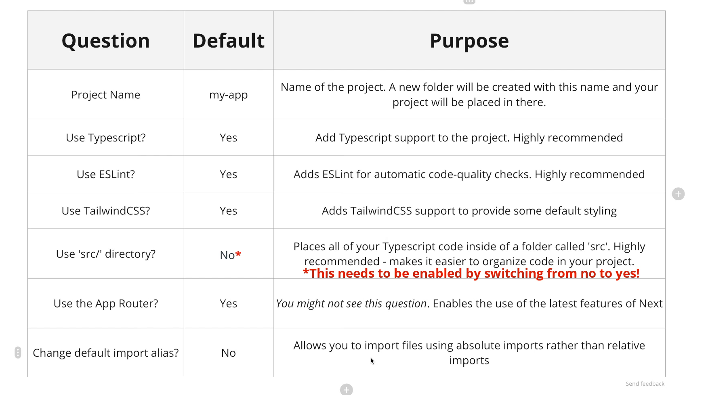
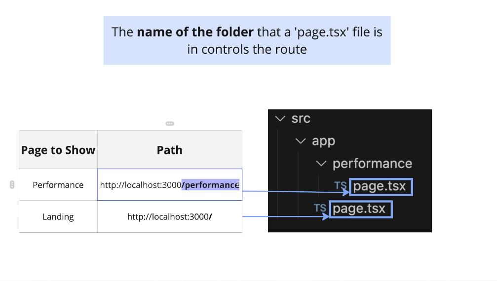
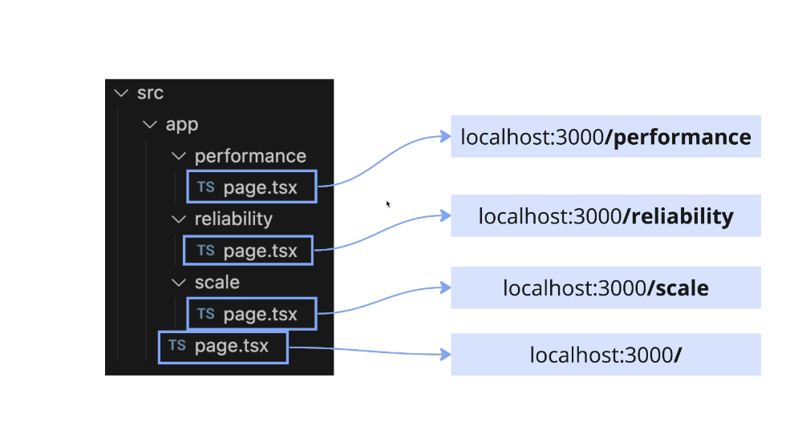
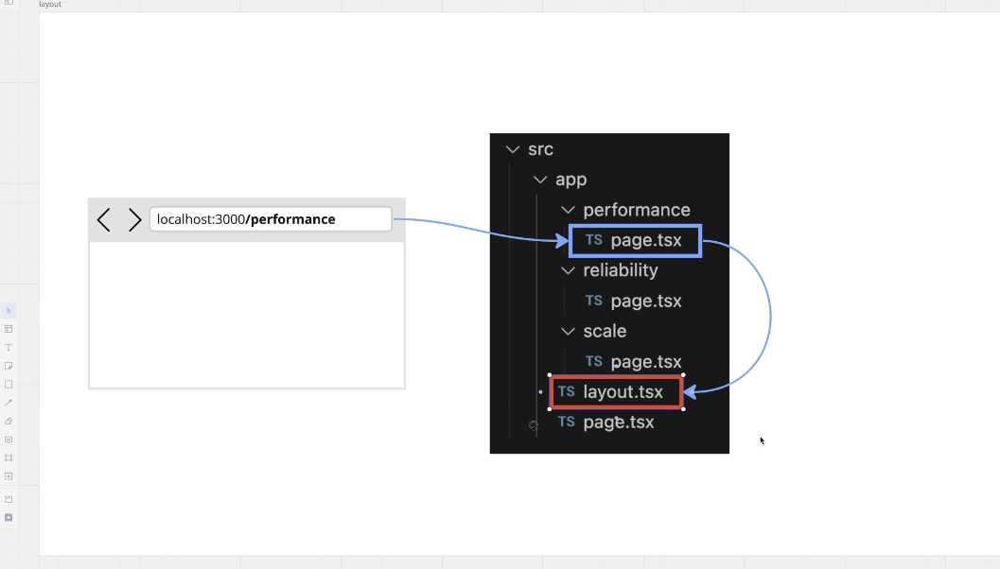
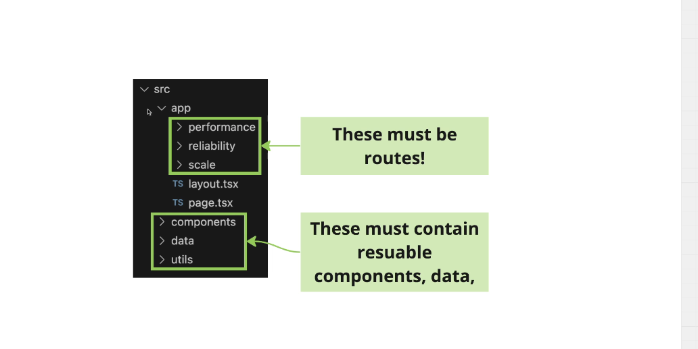
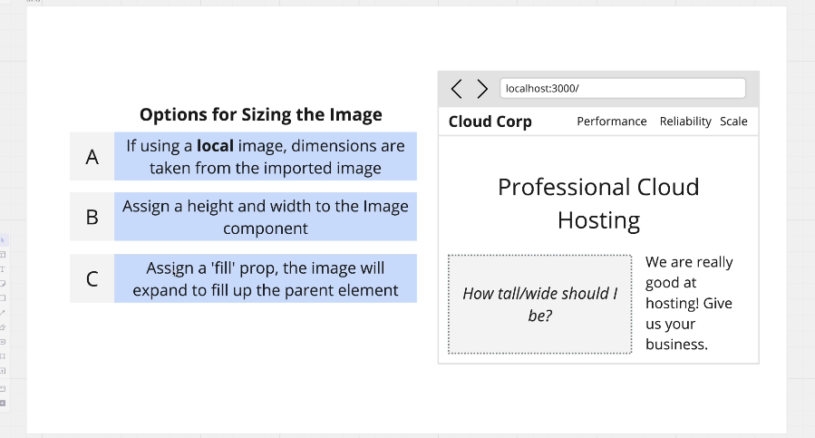

https://www.udemy.com/course/next-js-the-complete-developers-guide/

-   Stephen Grider - Complete Developers Guide

## 03. Project Overview

```sh
npx create-next-app@latest
```

-   setup project
-   note: should use `src/` folder



## 04. file-based routing

-   `src/app`
-   directories with `page.tsx` means a new route
-   route must have `export default` of a react component
-   url uses folder name



## 05. create additional routes

-   http://localhost:3000/performance
-   http://localhost:3000/reliability
-   http://localhost:3000/scale



## 06. Link component to link between pages

-   linking between pages

```ts
//src/pages.tsx

import Link from 'next/link';

export default function Home() {
    return (
        <>
            <div>
                <Link href="/performance">performance</Link>
                <Link href="/reliability">reliability</Link>
                <Link href="/scale">scale</Link>
            </div>
            <div>Home</div>
        </>
    );
}
```

## 07 Layouts for Common ui in nextjs

-   using a layout.tsx
-   components are rendered inside layout
-   UPDATE: cut from `src/pages.tsx` and paste in `layout.tsx`



```tsx
//src/layout.tsx
import type { Metadata } from 'next';
import { Geist, Geist_Mono } from 'next/font/google';
import './globals.css';
import Link from 'next/link';

const geistSans = Geist({
    variable: '--font-geist-sans',
    subsets: ['latin']
});

const geistMono = Geist_Mono({
    variable: '--font-geist-mono',
    subsets: ['latin']
});

export const metadata: Metadata = {
    title: 'Create Next App',
    description: 'Generated by create next app'
};

export default function RootLayout({
    children
}: Readonly<{
    children: React.ReactNode;
}>) {
    return (
        <html lang="en">
            <body className={`${geistSans.variable} ${geistMono.variable} antialiased`}>
                <div>
                    <Link href="/">Home</Link>
                    <Link href="/performance">performance</Link>
                    <Link href="/reliability">reliability</Link>
                    <Link href="/scale">scale</Link>
                </div>
                {children}
            </body>
        </html>
    );
}
```

## 08 project structure strategy

-   dont bloat layout.tsx
-   extract to its own file
-   but dont put in app/ since this folder has routes



-   extract the header to its own file (outside the app/ folder)
-   in src/app/layout.tsx import the header

```tsx
//src/components/header.tsx
import Link from 'next/link';

export default function Header() {
    return (
        <div>
            <Link href="/">Home</Link>
            <Link href="/performance">performance</Link>
            <Link href="/reliability">reliability</Link>
            <Link href="/scale">scale</Link>
        </div>
    );
}
```

## 09. Absolute path import shortcut

-   instead of using relative path imports
-   nextjs has alias which uses absolute path from `src` directory

```jsx
import Header from '@/components/Header';
```

## 10. working with images

-   download images.zip
-   NOTE: on the lesson, they import with `public` keyword along static images
-   but after nextjs v14.2 of Next or higher, update `tsconfig.json`

```json
// tsconfig.json
"paths": {
    "@/*": ["./src/*"],
    "public/*": ["./public/*"]
}
```

## 11. adding images in nextjs

### local images

-   extract images.zip to `public/`
-   instead of using `` tags
-   nextjs has `<Image>` component
-   `<Image/>` automatic image optimization

```tsx
//src/page.tsx
import Image from 'next/image';
import homeImg from 'public/home.jpg';

export default function Home() {
    return (
        <div className="absolute -z-10 inset-0">
            <Image alt="car factory" src={homeImg} fill style={{ objectFit: 'cover' }} />
        </div>
    );
}
```

## 12. More on the Image Component

-   `<Image>` component solves `layout shifting`
-   placeholder needs to know its size (width/height) 3 options:

    -   local image (public/) -> get dimensions from imported image
    -   asign width/height as props (sets defined dimensions)
    -   use `fill` prop


